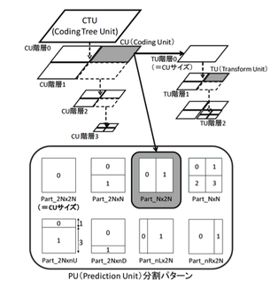

# HEVC review

Ref::
1. HEVC: The new gold standard for video compression; 2012 July;
1. an introduction to HDR and its support within the H.265/HEVC standard extensions; 2014 Dec;
## feature
### large block structures with flexible sub-partitioning mechanisms.

- MPEG2 or H.263 have rigid block size.
- H264 have Macroblock(16x16) and block(can split to to 4x4)
- HEVC have LCU -> CU -> PU ->??? TU layer (Coding Tree Unit, CTU)
    - LCU largest coding unit (64x64)
    - CU  coding unit (64x64~8x8) recursive partition
    - PU  prediction unis(CU~4x4) not recusive, only once; can asymmetric when inter-prediction. This is for match boundaries of objects in picture.
    - TU  transform units(32x32~4x4)


> change name to CTU, CB, PB, TB???

### slice -> tile

- support parallel encoding
- error resiliency

 H264: slice + FMO

 H265: tile + slice + entropy slice (no FMO)

### wavefront parallel processing(WPP)
start processing a new row of LCUs with a new parallel process.

entropy-coding parameters are initialized based on the information obtained from the two fully encoded LCUs in the row above.

> keep encode two more LCUs in the row above, It depend on above right LCUs.

### intraframe coding
more mode
- luma 35 modes (9 in H264)
- chroma 6 modes (4 in H264)

MDIS:: mode-dependent intra smoothing
three tap filter:: (1, 2, 1)/4

> hevc have so many intra mode, as camera may use all intra mode, and have high bitrate as requesting high quality. VP9 doesn't consider this case, so have not so many intra mode.

### improved subpixel interpolation
8-tap filter and 7-tap filter to generate luma half-pel and quarter-pel samples.

not bilinear interpolation (H264)

### motion parameter encoding

- MV (prediction and encoding MV difference of reference picture)
- motion merge
    - a list of previously encoded neighboring PUs (candidates)
    - if use same MV, only the index of candidates in motion merge list encoded.
- improved SKIP mode

### transform and quantization

- better
- DST
???

### entropy-coding

CAVLC or CABAC in H264

HEB:: High Efficiency binarization
    all CABAC
HTB:: High Throughput binarization
    CAVLC when residual coding module.

### Loop filter
#### deblocking filter
like H264

#### SAO:: Sample Adaptive Offset
- BO band Offset
- EO edge offset


### ALF:: Adaptive Loop Filtering


## software
HM

# HDR support
integrate with Dolby Vision

## Improving video quality
- increase spatial resolution
- increase temporal resolution
- increase information carried by each pixel
    HDR enhance this point. (compared with Standard Dynamic Range (SDR))

 SDR:: 0.1 ~ 100 cd/m2
 HDR:: 0.01 ~ 1000 cd/m2

luminance -> gamma correction -> brightness

> HDR use knee curve instead of gamma curve, but they are same princple.

Human eyes, can check 12bit depth gray range.

Modern displays, while still not able to display as wide a dynamic range as cameras, have also improved dramatically in the last decade.

### more colors
REC 709 -> **REC 2020** -> CIE XYZ

 Wide Color Gamut (WCG)

require more bits

> 因此HEVC标准支持10 bitdepth, 这是HDR特性的基础.

> first HDR(&WCG) feature, think need 12 bitdepth and YUV 444 sample.
actually, using 10 bitdepth and YUV420 sample is enough.
This is full match HEVC Main10 profile (or refered as HDR10)

> warning: this YUV420 sample is for codec, not for capturing or represention.
This two part need RGB 444 sample.

ref:[[http://ngcodec.com/news/2015/11/16/fpgas-are-best-for-encoding-high-dynamic-range-hdr-content-with-hevch265]]
```
In the example, the encoder side includes:

- The SMPTE ST 2084:2014 Electro Optical Transfer Function (EOTF) and Inverse-EOTF (OETF) commonly referred to as the Transfer Function (TF), which is applied to linear light samples in the RGB BT.2020 domain.
- Color conversion to the Non-Constant Luminance (NCL) YCbCr BT.2020 format.
- Chroma down-sampling to 4:2:0.
- Quantization to a 10 bit integer representation.

Essentially, HDR10 is defined as the combination of the following container and coding characteristics:

- Color container/primaries: BT.2020
- Transfer function (OETF/EOTF): SMPTE ST 2084
- Representation: Non Constant Luminance (NCL) YCbCr
- Sampling: 4:2:0
- Bit Depth: 10 bits
- Metadata: SMPTE ST 2086, MaxFALL, MaxCLL,  HEVC Supplemental enhancement information (SEI) Messages  
- Encoding using: HEVC Main 10 profile (iii)  

The HEVC specification supports all of these features as well as metadata (SEI) that can specify the mastering and brightness limitations characteristics of the content.
```

### brighter images

- Nature 40 bits
- Camera 14~15 bits
- SDR digital video 7-8bits
> so we need enhance video compression

- LCD 9~10bits
- Human eye 12bits

[[https://www.wikiwand.com/en/Colour_banding|color banding]]

色带问题,颜色的层级不够,导致原本渐变的颜色区域,采样后的颜色变换边缘有跳变现象,从而形成色带.

## dual layer

contains standard dynamic range information in one layer and additional dynamic range information in another layer.

This dual-layer HDR format has the advantage of working transparently with existing, non-HDR capable equipment.

## HDR related SEI messages in HEVC

HEVC的第二版增加了和HDR(或者range extension)相关的SEI

- Chroma resampling filter hint SEI

 may transform from one color space to other.
- Knee function information SEI

 transform brightness from HDR to SDR with multiple line segments (joined together to approximate a non-linear curve)
- Mastering display color volume SEI

 ???
 color primaries and luminance dynamic range of the display that was used to author the source.
