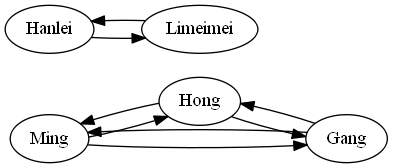
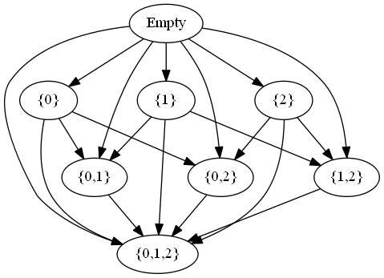
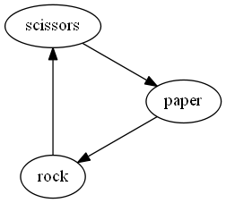
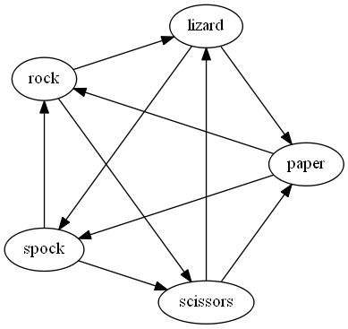
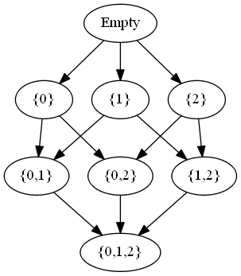
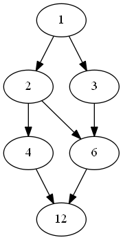
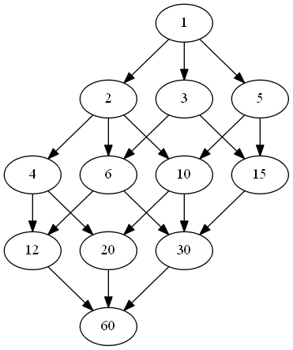
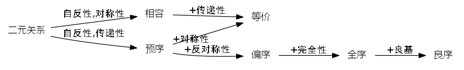

# 序理论

序理论，研究了数学上一个非常基础的概念：比较/排序问题。不管是“一吕二赵三典韦，四关五马六张飞”，还是三十六天罡、七十二地煞，抑或是金陵十二钗的正册、副册、又副册，都算是个排序问题。一般而言，一次比较最少涉及两个实体。因此我们首先将目光放大到所有的两个实体的关系上，数学上一般称之为“二元关系”。然后在研究是否可以比较的问题。

## 二元关系

二元关系，有的时候直接简称为“关系”。这是因为讲到关系，那么面向的是至少两个对象/实体之间的关系。

x，y属于集合A，若二者存在关系R，则记为xRy。（这里假定在集合论的基础上进行讨论。实际上序理论，并不依赖于集合论。）

为了便于理解，我们举几个例子：

1. 年级里面所有同学的集合，以及同班同学的关系。比如：小明和小红都在一年级18班，那么小明R小红。李梅梅在1班，则小明R李梅梅不成立。
2. 猜拳游戏。共有三种模式{石头，剪子，布}，以及前者胜于后者的关系。比如：石头胜过剪子，剪子胜过布，布胜过石头，也就是石头R剪子，剪子R布，布R石头。
3. 全集与子集的包含关系。以全集为{0,1,2}为例子，其中的两个子集{1}R{1,2}。

对于某一种关系，可能存在下面几种（之部分)的性质：

- 自反性：∀x∈A，xRx
- 反自反性：∀x∈A，xRx都不成立

自反性和反自反性，分别体现了集合中的任一元素，与自身之间是否可以构成这一个关系。在上面的例子中，同班同学的关系，具有自反性。因为自己也算是自己的同班同学。这在全集整个年级所有的学生身上都是成立的。

猜拳游戏中，则自反性不成立。而且对于所有的模式{石头,剪子,布}，都不是自反的。因此成立反自反性。

一种关系不是必然成立自反性或者反自反性的性质之一的。也有可能都不成立。比如存在某些元素上自反，某些元素反自反的关系。

对于集合包含的关系，自身也是自身的子集。A⊆A永远成立。因此自反性是成立的。不过对于真子集关系⊊关系，自反性不成立，而成立反自反性。

- 对称性：∀x,y∈A，如果xRy，则yRx。
- 反对称性：∀x,y∈A，如果xRy且yRx，则x和y相等。

对称性，就是看关系的成立，是否意味着相比于有序对(x,y)的逆序的有序对(y,x)上是否也存在关系。
反对称性，就是说，是不是只对于同一个元素上才存在对称关系。（也就是排除了在不同元素上的对称关系的可能性）

在上面的例子中，同班同学的关系，是对称的。你是我的同学，我也是你的同学，我们是纯洁的互为同学关系。

猜拳游戏，则不是对称的。因为石头胜过剪刀，而剪刀不能胜于石头（废话。。）。那么猜拳游戏是不是反对称的呢？也不是的。

集合包含的例子中，是存在反对称性的。如果对于集合A和B的子集（或者包含于）关系R的符号一般为⊆，A⊆B且B⊆A，则A=B。这也是证明集合相等的一种重要方法。

- 传递性：∀x,y,z∈A，如果xRy，yRz，则xRz。

同班同学的关系里面，传递性是成立的。我的同学的同学，也是我的同学。

在西欧[封建社会](https://zh.wikipedia.org/wiki/%E5%B0%81%E5%BB%BA%E7%A4%BE%E4%BC%9A#%E7%8B%AC%E6%9C%89%E7%9A%84%E5%B0%81%E5%BB%BA%E6%80%9D%E6%83%B3)的“教主-国王-领主-爵士”的制度下，有一句名言：“我的附庸的附庸，不是我的附庸”。举例来说，国王是教主的附庸，领主是国王的附庸。但是领主不是教主的附庸。我们记附庸(vassal)关系：x是y的的附庸这样的关系记为R，那么就有领主R国王，国王R教主。根据那句名言，就说明根据前述条件，不能推出领主R教主。这说明附庸关系，不存在"传递性"。

对于集合包含关系，传递性，也是存在的。∅⊆A⊆B⊆C⊆。。。子集的子集(或者反过来的超集的超集)，甚至可以构成一个序列。

对于猜拳中的关系，传递性显然不满足。石头胜过剪刀，剪刀胜过布，但是石头却是输给布的（布是胜过石头的）。这里的非传递的特点，甚至是这个游戏最初设计的核心要素。[石头剪子布中的非传递性](https://zh.wikipedia.org/wiki/%E7%9F%B3%E5%A4%B4%E3%80%81%E5%89%AA%E5%AD%90%E3%80%81%E5%B8%83#%E6%95%B8%E5%AD%B8%E5%8F%8A%E9%9D%9E%E9%81%9E%E7%A7%BB%E6%80%A7)。 如果存在传递性，那么就可能存在一种偏胜的策略或者偏负的策略。这里的偏胜，就是意味着相比于其他模式，其中一种模式是更好的。而这个游戏最初的设计者，就是要表达出这种循环往复的局面。在这种局面里，没有一种单纯的优或者劣的策略。这也是为什么这个游戏常见于悬而未决的时候，作为一种输赢赌赛的手段。对于这个游戏，在博弈论中进行更为深入的研究。

### 二元关系的关系图

通过以下步骤可以绘制关系图：

1. 集合A中的结点，通过点来表示
2. 若有关系x~y，则通过自x结点到y结点的有向箭头->表示

显然关系图是有向图。对于满足对称性的关系，则若存在x->y，必同时存在y->x。也就是箭头总是存在反向的箭头，那我们也可以使用无向图来表示这种对称的关系。
对于满足自反性的关系，则每个结点上都有一个从自身出发指向自身的箭头，在上下文清楚的情况下，我们也可以把这样的自反箭头省略掉来简化图形。
对于满足传递性的关系，我们可以将其转化为Hasse图。这点后面会展开说。

对于上面的同学关系，我们可以看到下图。韩雷和李梅梅都是擅长英语的1班。小明、小红、小刚则在擅长语文的18班。图中，省略了每个结点到自身的箭头。

对于集合的包含关系，我们有如下的关系图：

对于猜拳游戏，我们有如下关系图：

石头剪子布，这个游戏从中国传播到日本后发生了变异，变成了“石头-剪子-纸”。后来这种玩法又传播到西方。所以这里也采用了纸paper这种翻译。这完全不影响对于问题的理解。

在《生活大爆炸》中，谢尔顿提到一种猜拳游戏的变体：[石头、剪子、布、蜥蜴、史波克](https://zh.wikipedia.org/wiki/%E7%9F%B3%E5%A4%B4%E3%80%81%E5%89%AA%E5%AD%90%E3%80%81%E5%B8%83%E3%80%81%E8%9C%A5%E8%9C%B4%E3%80%81%E5%8F%B2%E6%B3%A2%E5%85%8B)。这种变体又增加了两种实体：蜥蜴和史波克。这种关系和中国的五行理论，其实有一定的相通之处啊。

石头剪子布的游戏，出现平局（或者不可比较）的可能性为3/3^2=1/3。这个几率比较高。而其上述的变种，则出现平局的可能性为5/5^2=1/5。从33。3%降低到20%。代价则是游戏变得更为复杂。而斗兽棋游戏中的，老鼠可是钻到大象的鼻子里，从而可以憋死大象。其实也可以视为石头剪子布游戏的衍生。但是因为不能很好的定义N^2上的游戏规则，反而并不如石头剪子布更为简单而有趣。

## 预序关系 preoder

满足自反性和传递性的关系，为预序关系。

在上面的例子中:

- 同班同学的关系，是预序关系。
- 集合的包含关系，也满足同时满足自反性和传递性，因此也是预序关系。
- 猜拳游戏中过的关系，不满足传递性，就不是预序关系了。

## 相容关系 consistent Relation

满足自反性和对称性的关系，为相容关系。

在上面的例子中：

- 同班同学的关系，也是相容关系。
- 集合的包含关系，就不满足对称性，因此不是相容关系。
- 如果我们把关系定义为如果子集A和子集B有相同的元素，则构成新的关系。那么这个新的关系显然是自反的。也是对称的。但是不再是传递的了。比如{1}R{1,2},{1,2}R{2}，但是显然不存在{1}R{2}。也就是集合具有相同元素的这种关系，为相容关系。
- 猜拳游戏，对称性也不满足。因此也不是相容关系。

至此，可以看到猜拳游戏因为不满足自反性、传递性、对称性等，因此不能将其归结为后续讨论的，基于预序关系和相容关系的其他概念，因此后文就略去不再赘述。对于后续的其他概念，可以以猜拳游戏这种关系作为反例。

## 等价关系 equivalence relation

满足自反性、传递性和对称性的关系，为等价关系。

等价关系，在预序关系的基础上，增加了对称性的要求；在相容关系上，增加了传递性的要求。这里可以看到一个类似于面向对象编程OOP的菱形继承的问题：

在上面的例子中：

- 同班同学的关系，既是相容关系也是预序关系，综合起来是等价关系。
- 集合包含的例子，则显然不是等价关系。
- 两个集合存在相同元素的关系，因为不满足传递性，因此也不是等价关系。

## 偏序关系 partial order

满足自反性、传递性和反对称性的关系，为偏序关系。

在上面的例子中：

- 同班同学不满足反对称性（除非每个班级里面只有一个学生）。因此不是偏序关系。
- 集合包含的例子，则如前所述是反对称的。因此集合包含关系，是偏序关系。

## 全序 total order

偏序关系，并不保证在任意x,y∈A都有定义(或者都成立）。而如果进一步的，如果对于任意的x,y∈A，总是存在xRy，或者存在yRx。那么这种定义就是完全的（也就是都所有的情况都有明确的成立或者其反向关系成立），那么这种关系就是全序关系。

显然全序关系，是偏序的递进，增加了完全性的要求。

对于不满足偏序关系的例子，显然不可能满足全序关系。

继续研究集合包含的例子，对于某些集合对{1}，{2}，显然我们不能够判定{1}是{2}的子集，也不能说{2}是{1}的子集。因此集合包含的例子，不是全序的。

根据全序关系的完全性，因为任意两者都可以可以进行比较的，因此我们可以把集合中的所有元素根据传递性串联起来，就像一根线一样，因此全序也称为线性序或者链。在这根线上，一个元素只能出现一次，那么显然就有aRa，也就是满足自反性。因此完全性这个性质蕴含了自反性。在全序关系中，我们使用≤符号来代替之前的R。那么根据完全性，x≤y的反面（逆补关系)，我们定义符号为x>y。而当x≤y，y≥x二者同时成立的情况，我们记为x=y。对于x≤y,且x≠y的情况，我们定义为符号x\<y，类似的还有有≥符号。这就是全序关系中的[三分性](https://zh.wikipedia.org/wiki/%E4%B8%89%E5%88%86%E5%BE%8B)。也就是全序关系中，序的关系，为这三者之一。对于在Haskell中，Ord的结果就是LT,EQ,GT三个结果之一。

从反向的角度，满足偏序关系，任意两个元素x,y比较只有四种可能性{x≤y且y≤x不成立,x≤y不成立且y≤x,x≤y且y≤x，x≤y与y≤x都不成立}，也即{<,>,=,不可比较}这四种可能性。而完全性，就是排除了不可比较的可能性，从而形成三分性。

全序关系的例子，实际上非常多。对于整数的大小比较，就是全序关系。类似的，实数的比较也是的。但是复数，就不是的。因为我们不能直接比较比如1和i的大小。

## 哈斯图 Hasse Graph

我们可以看到这个关系图里面，根据传递性，有∅⊊{0}⊊{0,1}⊊{0,1,2}，我们有很多冗余的线。比如∅⊊{0}，{0}⊊{0,1}，那么其实就不需要把∅⊊{0,1}再画出来。因为隐含在其中，根据传递性已经可以推导出来了。这个过程在数学上就是传递约简(transitive reducation)的过程。

比如对于12的所有因子{1,2,3,4,6,12}按照整除性排序，那么有图如下。

对于60的所有因子按照整除性排序{1,2,3,4,5,6,10,12,15,20,30,60}，那么有图如下：

根据12=2^2\*3,60=2^2\*3\*5,我们可以看到这个表达式和Hasse图的结构之间有着相应的映射关系。

## 符号和概览

每种关系的特性，也体现在各自的符号的特点上。
在上面的讨论中，我们只是用R这个符号来表示通用的关系。而对于有着更多性质的其他关系，我们一般使用更形象的符号来表示。

| 关系     | 符号 | 衍生符号 | 性质                     | 例子                   |
| -------- | ---- | -------- | ------------------------ | ---------------------- |
| 二元关系 | R    |          |                          | 猜拳游戏               |
| 相容关系 | R    |          | 自反，对称               | 集合有相同元素的关系   |
| 等价关系 | ~    |          | 自反，对称，传递         | 同班同学               |
| 预序     | ≲    |          | 自反，传递，不一定对称   |                        |
| 偏序     | ≤    |          | 自反，传递，反对称       | 集合的包含关系，整除性 |
| 全序     | ≤    | ≥,=,<,>  | 自反，传递，反对称，完全 | 整数的比较             |

- 二元关系，是最为抽象的，因此直接使用字母R，而不是具体的符号来表示。
- 等价关系，是对称的，因此其符号'~'也是唯一的左右对称的符号。
- 预序关系，没有体现出对称或者反对称的特点，因此它的符号也是介于等价关系和偏序关系之间的符号。
- 偏序关系，就是一般而言的小于等于的符号，体现了两个元素上不对称的特点，但又保持了相等的可能性。
- 到了全序关系，根据完全性，我们有三分性，也就是有了更多的衍生的符号。

具有对称性的关系，一般有对称的符号，比如“~”。对于反对称性的关系，一般有等号“=”。对于有不对称的传递性，一般有“<"。还是挺形象的吧？

根据性质，我们可以推出各种关系的衍生关系如图。

在排序算法中，基于比较类的算法（如，快排、归并排序等等）一般要求元素为全序关系，因为可能涉及到序列里全部元素之间的比较。对于[拓扑排序](https://en.wikipedia.org/wiki/Topological_sorting)算法，一般只要求偏序关系。而拓扑排序算法，就是将偏序的Hasse图，转化为全序序列（转换结果可能并不唯一）的过程。同理也可以看到拓扑排序的图中，不可能有环形存在。因为那样就不满足偏序关系的传递性了。