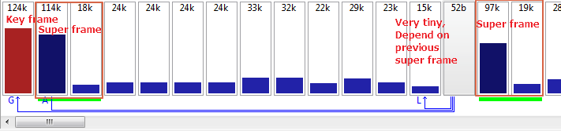

# vpx
## vp8
## vp9
- YUV420 only
- progressive only, not support field coding

### partitioning
- super block(SB): 64x64-sized blocks, raster scan

- no slice
- tiles
    tiles dependency is broken in rows, but not betweeen horizontal boundaries.

> as this trend, from raster-scan to tiles style, at different level.

- bitstream
    - ivf or webm
        - if no container at all, it's impossible to seek to a particular frame, as no start code
    - all VP9 bit stream start with a key frame
    - like VP8, VP8 compress using a 8bit arithmetic coding engine (bool-coder). The probability is fixed in one frame, (CABAC is adaptive)

Each frame is coded in three sections

1. Uncompressed header, like picture size, loop filter strength
1. Compressed header, bool-coded section (use default probability)
1. Compressed frame data

Residual coding::

- support 4 transform size: 32x32, 16x16, 8x8, 4x4
- interger approximation of DCT, (also may DST with specific characteristics)
- coefficient ordering is not very predicatable like diagonal or zigzag scan, it need look up table.

Lossless

- block are always 4x4, no inverse quantization, Walsh 4x4

### Super frame

VP9 does not support "compound prediction". In order to avoid patens on bi-prediction, compound prediction is only enabled in frames that are marked as not-displayable.

A frame like this is never output for display, but may be used for reference later. In fact, a later frame may consist of nothing but 64x64 blocks  with no residuals and 0,0 motion vectors, that points to this non-displayed frame. Effectively causing it to be output later using very little data.

When puting VP9 bitstream in a container, we have issue. Each "frame" from container should result in a displayable frame.

To resolve this, VP9 introduce concept of super frame.

A super frame is simply one or more non-displayable frames and one displayable frames all strung together as one chunk of data in container. Thus decoder still output a frame, and the internal references are all updated with non-displayable frames.

### reference
- [http://forum.doom9.org/showthread.php?t=168947]

## vp10
